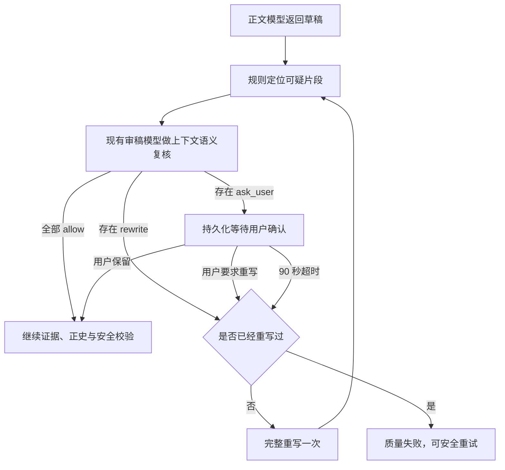

# 上下文语义叙事门禁与用户反馈闭环设计

状态：已确认

日期：2026-07-24

范围：开篇正文中的作者侧元叙事检测、语义复核、用户裁决、超时重写与隐私安全反馈

关联：本设计细化并部分修订《2026-07-20 任意体验词通用出书与中途改意图设计》中“元叙事词表属于确定性硬门禁”的安排；继续遵守 ADR 0002《使用脱敏失败观测驱动生成纠错》。

## 1. 背景与问题

线上任务曾连续两次在“开篇正文质量校验”阶段被分类为 `narration_metadata`。最终日志显示正文中的自然表达“半本卷边残诗稿”被误判为作者侧元叙事，原因是现有正则把其中连续出现的“本卷”当成“本卷规划”。

这个问题说明：词面规则适合定位可疑内容，不适合单独裁决开放式中文散文。继续补充前后缀和排除词只能修复已知边界，并会制造新的边界。另一方面，完全删除元叙事门禁会让“作者在这里安排转折”“本卷目标是推进角色弧”等真实泄露进入正文，破坏沉浸阅读。

## 2. 已确认的产品决策

1. 现有元叙事规则只负责定位可疑片段，不再直接判定正文失败。
2. 复用现有开篇审稿模型阅读命中句及前后句，不新增模型角色或管理员配置。
3. 审稿模型返回 `allow`、`rewrite` 或 `ask_user`。
4. 只有语义模糊的情况交给故事所有者判断；管理员不参与在线审批。
5. 用户可选择“保留原文”或“AI 重写”；90 秒无操作时默认自动重写。
6. 自动整章重写最多一次，避免无限生成和失控成本。
7. 后台默认长期保存结构化反馈，不保存原句；只有用户明确同意时才保存脱敏、限长的上下文。
8. 安全、隐私、鉴权、正史冲突等硬门禁不允许用户绕过，本设计仅适用于沉浸叙事质量门禁。

## 3. 目标与非目标

### 3.1 目标

- 放行“半本卷边残诗稿”等能在故事世界内自然成立的表达。
- 自动拦截真正提及作者、章节安排、写作过程或剧情规划的元叙事。
- 将模型也无法稳定判断的少量边界交给当前用户，不依赖管理员在线。
- 用户关闭页面、网络断开或服务重启后，待确认任务仍能在期限到达时自动处理。
- 把用户决定转化为可聚合、可审计的规则质量反馈，同时保护正文与原始灵感。

### 3.2 非目标

- 不把用户选择用于绕过安全策略、隐私保护或正史一致性。
- 不把某位用户的原句自动注入其他用户的提示词或生成任务。
- 不在本阶段训练新分类模型，也不自动修改线上规则。
- 不保存完整失败稿、完整章节、原始灵感或模型提示词作为长期分析数据。
- 不新增管理员人工审批队列。

## 4. 设计原则

1. **规则定位，语义裁决。** 确定性规则输出候选位置，不直接输出最终结论。
2. **复用既有审稿调用。** 正文审稿模型已经读取完整章节；将候选上下文加入同一次请求，避免新增调用、模型配置和额外等待。
3. **只把歧义交给用户。** 明显正常的表达自动放行，明显元叙事自动重写，用户只处理审稿模型无法稳定裁决的少数情况。
4. **异步状态必须持久化。** 不能依赖一个长时间保持的 HTTP 请求或浏览器页面。
5. **反馈与正文分层存储。** 业务运行所需的临时上下文与长期产品反馈拥有不同生命周期。
6. **用户决定绑定具体稿件。** 一次保留决定只对当前内容哈希与候选位置有效，不成为全局白名单。

## 5. 组件设计

### 5.1 可疑片段检测器

现有 `assertImmersiveNarration` 拆成两个职责：

- 高精度结构校验继续处理章节标题格式等明确结构问题。
- 元叙事词面规则改为 `detectNarrationCandidates`，返回零个或多个候选，不抛出异常。

每个候选至少包含：

```ts
interface NarrationCandidate {
  id: string;
  ruleId: string;
  ruleVersion: string;
  location: "title" | "body";
  matchedText: string;
  matchStart: number;
  matchEnd: number;
  sentence: string;
  previousSentence?: string;
  nextSentence?: string;
  contentHash: string;
}
```

句子边界按中文句号、问号、叹号、分号、换行和段落边界解析，并正确处理引号内标点。给审稿模型的上下文最多包含命中句及前后各一句，避免无关文本影响判断；审稿模型仍可读取已有的完整正文。

### 5.2 上下文语义审稿

候选列表加入现有开篇审稿请求。每个候选必须返回独立结果：

```ts
interface NarrationAssessment {
  candidateId: string;
  worldInternal: boolean;
  writingProcessReference: boolean;
  decision: "allow" | "rewrite" | "ask_user";
  confidence: number;
  reason: string;
}
```

字段含义：

- `worldInternal`：整句话是否能被故事世界中的人物、物件、事件或叙述自然解释。
- `writingProcessReference`：是否确实提到作者、读者、章节安排、剧情规划、角色弧或写作过程。
- `reason`：只解释语义，不复述内部提示词，不生成替代正文。

服务端对结果做一致性收敛：

- `worldInternal=true`、`writingProcessReference=false` 且置信度达到阈值：`allow`。
- `worldInternal=false`、`writingProcessReference=true` 且置信度达到阈值：`rewrite`。
- 字段矛盾、置信度不足、缺少候选、Schema 错误或模型调用异常：`ask_user`。

初始自动裁决阈值设为 `0.85`，作为可配置值记录在反馈中；后续只能依据聚合反馈和回归样本调整。

### 5.3 决策编排

- 所有候选均为 `allow`：继续既有体验证据与正史事件校验。
- 任一候选为 `rewrite`，且当前作业尚未执行过重写：进入现有完整重写流程。
- 存在 `ask_user`：持久化待确认案例，将作业状态切换为 `awaiting_user_review`。
- 已执行一次重写后仍出现明确 `rewrite`：终止作业并返回可安全重试的质量失败。
- 已执行一次重写后出现 `ask_user`：仍允许用户保留当前稿；若用户选择重写或超时，则因重写额度耗尽而终止作业，不开启无限循环。

用户选择“保留”只跳过被展示的候选，正文仍须通过体验证据、正史、安全、隐私和其他质量校验。

### 5.4 用户确认界面

网页展示：

- 命中句及前后句；命中词高亮。
- 简短说明：“系统无法确定这句话是在描述故事内物件，还是在谈论章节或写作安排。”
- “保留原文并继续”和“让 AI 重写”两个主操作。
- 90 秒倒计时及“超时后将自动重写”的明确说明。
- 默认不勾选的独立同意项：“匿名提交这三句话的脱敏版本，用于改进检测。”

界面不得显示内部提示词、开篇蓝图、体验契约或审稿模型的隐藏指令。只有作业所有者可以读取案例和提交决定。

### 5.5 持久化状态

新增持久化的待确认案例，概念字段如下：

```ts
interface PendingNarrationReview {
  id: string;
  jobId: string;
  ownerId: string;
  contentHash: string;
  attempt: number;
  rewriteCount: number;
  status: "pending" | "kept" | "rewrite_requested" | "timeout_rewrite" | "failed" | "resolved";
  deadlineAt: string;
  candidates: NarrationCandidate[];
  assessments: NarrationAssessment[];
  createdAt: string;
  resolvedAt?: string;
}
```

候选上下文属于临时业务数据：决定完成后立即清除文本，仅保留结构化结果；异常情况下最长保留 24 小时，超过期限后清除并把作业转为可安全重试的失败。

## 6. 数据流与状态变化



客户端通过现有生成作业状态获取 `awaiting_user_review`，再读取待确认案例。用户决定接口使用内容哈希和案例版本做乐观并发校验，避免对已变化的草稿应用旧决定。

## 7. 超时、并发与恢复

1. 案例创建时写入 `deadlineAt = createdAt + 90 秒`，提交事务后才向客户端返回等待状态。
2. 用户决定通过数据库条件更新完成，只允许 `status=pending` 的记录进入终态。
3. 超时工作器使用相同的条件更新抢占案例；用户点击与超时同时发生时只有一个更新成功。
4. 决策处理使用稳定幂等键；网络重试不会触发两次重写或两次创建故事。
5. 服务启动时扫描过期 `pending` 案例，并恢复超时重写或额度耗尽失败。
6. 运行期间周期性处理到期案例，因此用户关闭页面或断网不会阻塞作业。
7. 数据库无法持久化待确认状态时，不允许只在内存中等待；作业应失败并提示安全重试。

## 8. 反馈数据与隐私

### 8.1 默认长期保存的结构化反馈

- 规则 ID、规则版本和候选位置类型。
- 审稿模型路由、结构化判断、置信度和判定版本。
- 用户选择、超时自动选择或系统自动决定。
- 作业尝试次数、是否完成重写、重写后是否成功。
- 处理耗时、错误原因码和不含正文的内容哈希。

默认反馈不包含命中句、相邻句、完整正文、故事标题、原始灵感、提示词或模型原始响应。

### 8.2 用户明确同意后的上下文反馈

- 只保存命中句及前后各一句，合计长度设硬上限。
- 保存前脱敏邮箱、URL、访问令牌、API Key、用户与连接标识。
- 与用户决定、规则版本和审稿判断关联，不与其他用户的生成输入拼接。
- 默认保留 90 天后自动删除；用户撤回同意或删除账户时提前删除。
- 同意框默认关闭，拒绝提交不影响本次生成结果。

### 8.3 产品分析

后台按规则版本聚合：

- 用户保留率，可作为误报率的近似信号。
- 用户重写率与超时重写率。
- 审稿模型 `allow/rewrite/ask_user` 分布。
- 重写后成功率和最终作业成功率。
- 审稿模型决定与用户选择的分歧率。

这些指标用于人工评审和后续发布版本化纠错规则，不自动修改线上规则，也不自动学习或复用用户原句。

## 9. 异常处理

- 审稿模型超时、异常、Schema 无效或候选漏项：进入 `ask_user`，而不是静默放行。
- 用户无操作：90 秒后自动请求重写；若重写额度已耗尽，则明确失败并允许安全重试。
- 用户提交决定时内容哈希不匹配或案例已结束：返回冲突状态，客户端刷新最终结果。
- 临时上下文超过 24 小时仍未处理：删除上下文并结束任务，不留下永久等待记录。
- 语义复核完成后，任何安全、隐私、鉴权或正史门禁失败仍按原逻辑处理。
- 反馈写入失败不得影响已经完成的正文发布，但必须记录结构化运维错误；待确认状态写入失败则必须中止，因为无法安全恢复。

## 10. 测试与验收

### 10.1 单元测试

- 中文句界提取覆盖引号、换行、省略号、问号、叹号和段落边界。
- “半本卷边残诗稿”“这本卷边旧书”“基本卷积运算”形成候选后被语义结果放行。
- “本卷目标是推进角色弧”“作者在这里安排转折”被判为重写。
- 结构化判断矛盾、低置信度和 Schema 缺失统一降级为 `ask_user`。
- 用户保留决定只绑定当前内容哈希和候选 ID。

### 10.2 集成测试

- `allow` 路径继续现有审稿、证据与正史校验并成功创建故事。
- `rewrite` 路径只重写一次；第二稿通过后正常完成。
- `ask_user -> keep`、`ask_user -> rewrite` 和 `ask_user -> timeout` 三条路径均可收敛。
- 用户决定与超时并发时只有一个决议和一次重写。
- 服务在等待期间重启后能够恢复案例并执行到期处理。
- 重复 API 请求不会重复消费 token、重复创建故事或重复写入反馈。

### 10.3 隐私测试

- 未勾选同意时，长期反馈中不存在原句或相邻句。
- 勾选同意时只保存限长、脱敏的三句上下文。
- 临时上下文在案例解决后删除，异常情况下不超过 24 小时。
- 安全门禁和其他用户的作业不能读取该上下文。

### 10.4 验收标准

- 已知“半本卷边残诗稿”回归样本不再导致终态失败。
- 明确元叙事样本仍全部被重写或拦截。
- 所有待确认案例在用户决定或期限到达后进入终态，不产生永久 `pending`。
- 无同意的原句长期存储数量为零。
- 用户决定与超时竞态测试中，重复重写和重复创建数量为零。
- 新流程不新增模型调用，也不要求管理员配置新的模型路由。

## 11. 发布与回滚

1. 先在本地回归样本和集成测试中启用新流程。
2. 使用功能开关在生产环境启用；切换前保留旧硬门禁作为可回滚实现，但同一作业只运行一套裁决逻辑。
3. 启用后重点观察用户保留率、`ask_user` 占比、超时重写率、最终成功率和待确认积压。
4. 出现状态恢复或隐私问题时关闭功能开关，恢复旧门禁；已经存在的待确认案例按超时重写策略收敛，不直接丢弃。

## 12. 预计影响范围

- `server/narrationPolicy.ts`：从“命中即抛错”拆为候选检测与高精度结构校验。
- `server/modelGateway.ts`：扩展现有审稿 Schema、决策编排和一次重写流程。
- `server/index.ts`：待确认查询、用户决定、超时恢复与鉴权入口。
- `server/database/`：待确认案例和反馈记录的迁移与持久化。
- `server/failureTelemetry.ts`：增加稳定原因码、规则版本与决议来源，但继续脱敏。
- `src/types.ts`、`src/api.ts` 与生成页面：等待状态、确认卡片、倒计时和同意项。
- `src/pages/OpsPage.tsx`：只展示聚合指标，不展示未经同意的正文上下文。
- `tests/`：句界、语义决策、超时竞态、恢复、幂等和隐私回归测试。

